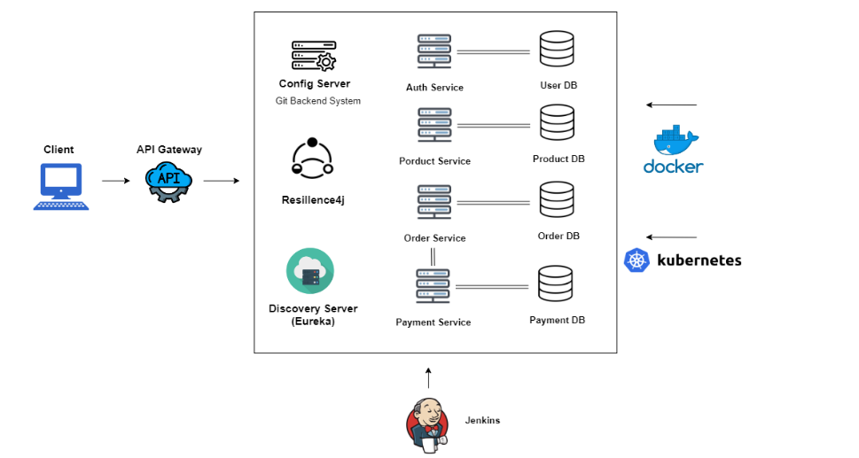
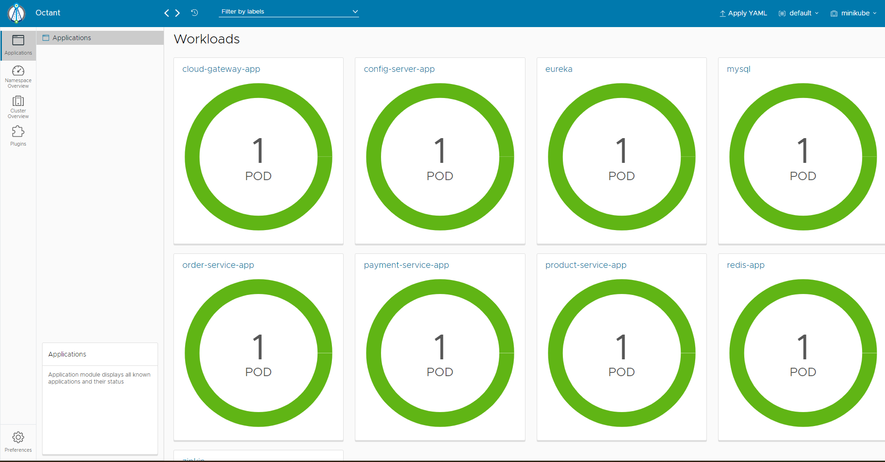
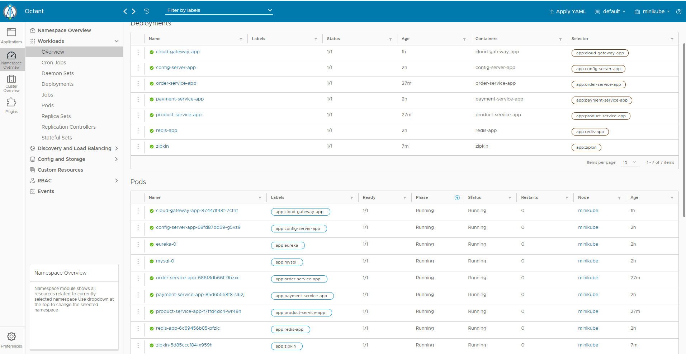
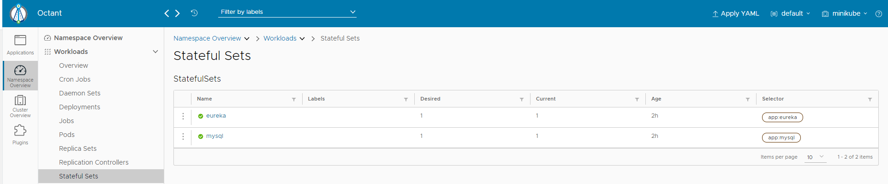
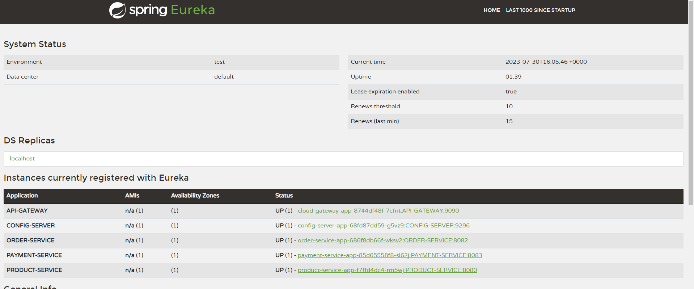
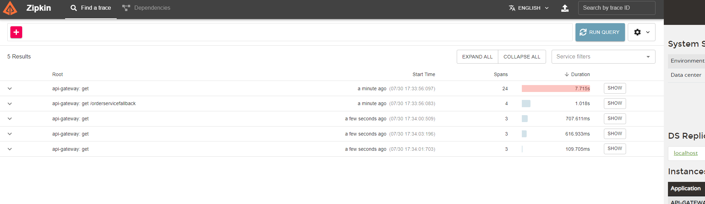
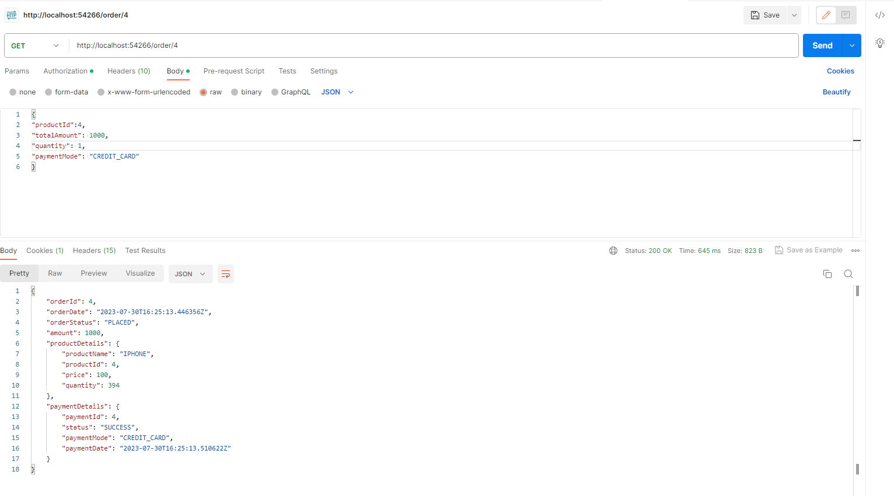

# SpringBoot-microservices-k8s-docker including Eureka Server, Config Server, API Gateway, Services , Zipkin, Redis, Resilience4j

###Docker file 
- docker build -t kamalrajput755/configserver:0.0.1 .
- docker build -t kamalrajput755/serviceregistry:0.0.1 .
- docker build -t kamalrajput755/cloudgateway:0.0.1 .
- docker run -d -p8761:8761 --name serviceregistry imageId
now to make other microservices register on eureka server running in a separate container, we have to do networking.
We have to pass on environment variable used in application yaml. Instead of using localhost, we have to use host.docker.internal
to make docker containers connect to their internal network.

- docker run -d -p9296:9296 -e EUREKA_SERVER_ADDRESS=http://host.docker.internal:8761/eureka --name configserver imageId
- docker run -d -p9090:9090 -e CONFIG_SERVER_URL=host.docker.internal  -e EUREKA_SERVER_ADDRESS=http://host.docker.internal:8761/eureka --name cloudgateway imageId
- docker run -d -p8080:9090 -e CONFIG_SERVER_URL=host.docker.internal  -e EUREKA_SERVER_ADDRESS=http://host.docker.internal:8761/eureka --name productservice imageId
- docker run -d -p 9411:9411 openzipkin/zipkin
- docker run --name latestredis -d -p 6379:6379 redis 
### command to build and pus docker images : 
- mvn clean install jib:build.This doesnt require docker to be installed on your machine.
- It will create the image and push it to docker hub. If you require the image locally, you need to pull it and run accordingly.

### K8s commands to deploy:
- kubectl apply -f configmaps.yaml
- kubectl apply -f mysql-deployment.yaml
- kubectl apply -f zipkin-deployment.yaml
- kubectl apply -f redis-deployment.yaml
- kubectl apply -f service-registry-statefulset.yaml
- kubectl apply -f config-server-deployment.yaml
- kubectl apply -f cloud-gateway-deployment.yaml
- kubectl apply -f payment-service-deployment.yaml order-service-deployment.yaml product-service-deployment.yaml
#Removed usage of configServer in cloudgateway as it was creating issue in connecting.
-----

### Screenshots

